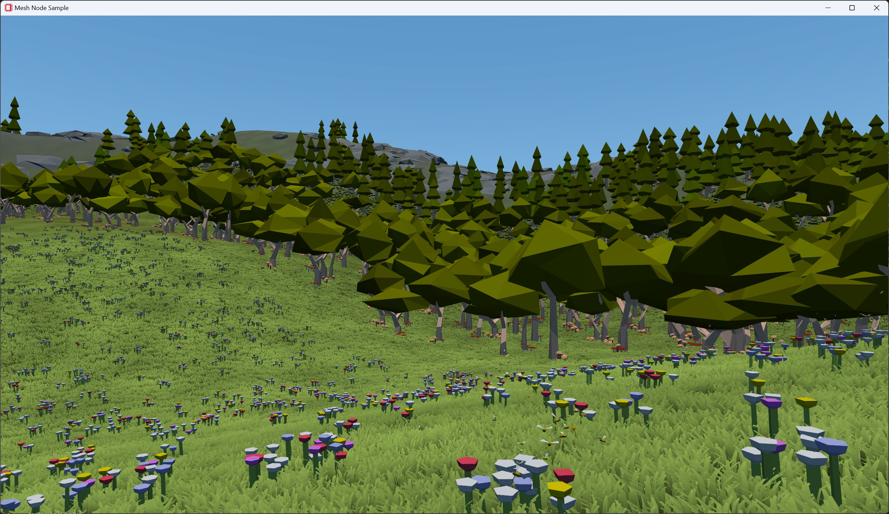

# Work Graphs Mesh Node Sample



This sample shows fully GPU-driven rendering through work graphs and mesh nodes in action.
If you wish to learn more about this sample, work graphs or mesh nodes, you can check out our accompanying blog post on [GPUOpen](https://gpuopen.com/learn/work_graphs_mesh_nodes).

## Building the sample

### Prerequisites 

To build the Work Graphs Mesh Node Sample, you must first install the following tools:

- [CMake 3.17](https://cmake.org/download/)
- [Visual Studio 2019](https://visualstudio.microsoft.com/downloads/)
- [Windows 10 SDK 10.0.18362.0](https://developer.microsoft.com/en-us/windows/downloads/windows-10-sdk)
- [Vulkan SDK 1.3.239](https://vulkan.lunarg.com/) (build dependency of Cauldron)

You will also need a mesh node compatible driver. Information on driver availability can be found [here](https://gpuopen.com/learn/work_graphs_mesh_nodes/work_graphs_mesh_nodes-getting_started).

### Getting up and running

Clone the repository
```
git clone https://github.com/GPUOpen-LibrariesAndSDKs/WorkGraphsMeshNodeSample.git
```

Inside the cloned repository, run
```
cmake -B build .
```
This will download the [FidelityFX SDK](https://github.com/GPUOpen-LibrariesAndSDKs/FidelityFX-SDK/tree/release-FSR3-3.0.4), [Agility SDK](https://www.nuget.org/packages/Microsoft.Direct3D.D3D12) and [Direct X Shader Compiler](https://www.nuget.org/packages/Microsoft.Direct3D.DXC) and put them all together with the sample project.  
You can find the scripts for this in the [`imported`](./imported/) folder.

Open the generated Visual Studio project with
```
cmake --open build
```

Build & run the `MeshNodeSample` project.

### Controls

| Key                  | Action                                                                          |
| ---------------------|---------------------------------------------------------------------------------|
| **Left Mouse + Drag**| Rotates the camera view direction.                                              |
| **Mouse wheel**      | Increase/Decrease camera movement speed.                                        |
| **A**                | Strafe the camera to the left.                                                  |
| **W**                | Move the camera forward.                                                        |
| **S**                | Strafe the camera to the right.                                                 |
| **D**                | Move the camera backward.                                                       |
| **Q**                | Move the camera upwards.                                                        |
| **E**                | Move the camera downwards.                                                      |
| **F1**               | Toggles the main UI on/off.                                                     |
| **F2**               | Toggles the performance UI on/off.                                              |
| **F3**               | Toggles the message log UI on/off. (Defaults to on in debug and off in release) |
| **M**                | Toggles magnifying glass.                                                       |
| **L**                | Toggles magnifying glass lock when enabled.                                     |
| **ESC**              | Shutsdown and quits sample.                                                     |
| **Alt-Enter**        | Toggles fullscreen mode.                                                        |